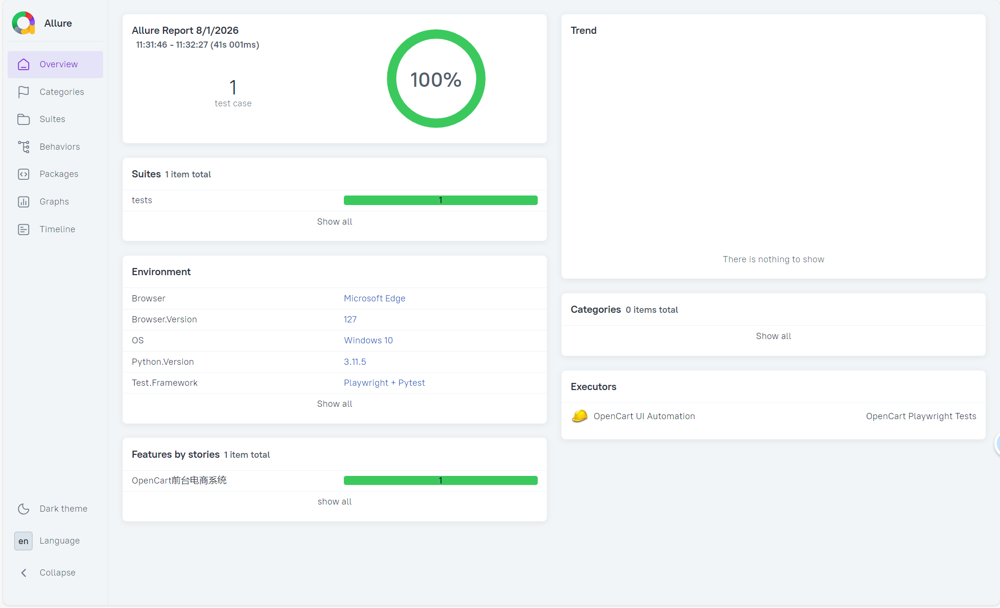

# OpenCart UI 自动化测试

## 📌 项目简介

基于 **Playwright + Python + POM** 实现的 OpenCart 电商系统 UI 自动化测试项目。
覆盖登录、注册、结算三大核心模块，共 **15 条**测试用例，**14 条通过，1 条跳过**。

## 🛠️ 技术栈

| 工具 | 用途 |
|------|------|
| Python 3.11 | 编程语言 |
| Playwright | 浏览器自动化 |
| Pytest | 测试框架 |
| Allure | 测试报告 |
| POM | 页面对象模型 |

## 📁 项目结构
opencart_auto_test/
├── pages/ # PO页面层（LoginPage/CartPage/CheckoutPage/RegisterPage）
├── tests/ # 测试用例层
├── config.py # 全局配置
├── conftest.py # 全局夹具（Allure环境配置、失败截图）
├── allure-results/ # 测试执行日志
├── requirements.txt # 依赖清单
└── run_ui_tests.bat # 一键运行脚本

text

## 📊 测试覆盖

| 模块 | 用例数 | 通过 | 跳过 | 通过率 |
|------|--------|------|------|--------|
| 登录 | 7 | 7 | 0 | 100% |
| 注册 | 6 | 5 | 1 | 83.3% |
| 结算 | 2 | 2 | 0 | 100% |
| **合计** | **15** | **14** | **1** | **93.3%** |

## 🚀 快速开始

```bash
# 安装依赖
pip install -r requirements.txt

# 运行所有 UI 测试
pytest tests/ -v --headed

# 运行指定模块
pytest tests/test_login_ui.py -v --headed

# 生成 Allure 报告
pytest tests/ -v --alluredir=./allure-results
allure serve ./allure-results

# 一键运行（Windows）
run_ui_tests.bat
```

## 📄 测试报告


## 🔗 相关链接
OpenCart 官网

Playwright 文档

Allure 报告

## 📌 测试环境
OpenCart 4.x（本地部署）

测试地址：http://localhost/opencart

测试账号：mytest203@test.com / Open2026
