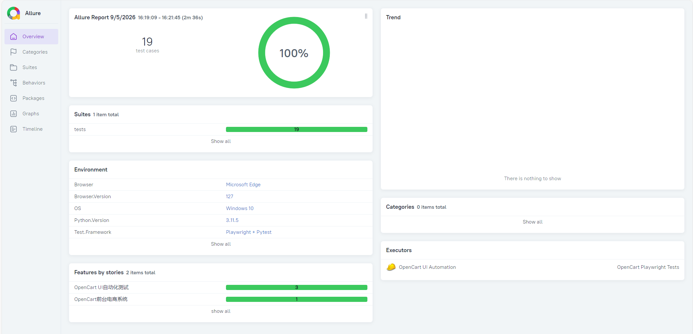

# OpenCart UI 自动化测试

[](https://github.com/StillStream-ink/opencart-auto-test/actions/workflows/test.yml)

---

## 📌 项目简介

基于 **Playwright + Python + POM 四层架构** 实现的 OpenCart 电商系统 UI 自动化测试项目。覆盖登录、注册、购物车、结算四大核心模块，共 **19 条**测试用例，**全部通过**。

- **POM 四层架构**：BasePage（公共操作）→ Pages（页面封装）→ Flows（业务流程）→ Tests（用例断言）
- **失败自动截图**：用例失败自动截全屏图挂到 Allure 报告，提升问题定位效率
- **双通道通知**：飞书机器人推送结构化测试报告，邮件作为备用通知
- **CI 集成**：GitHub Actions 在 push/PR 时自动触发，Windows 定时任务每日静默运行

---

## 🛠️ 技术栈

| 工具 | 用途 |
|------|------|
| Python 3.11 | 编程语言 |
| Playwright | 浏览器自动化 |
| Pytest | 测试框架 |
| Allure | 测试报告（含环境信息自动生成） |
| POM | 页面对象模型（四层架构） |
| GitHub Actions | 持续集成 |
| 飞书 Webhook | 测试完成通知 |

---

## 📁 项目结构

```text
opencart-auto-test/
├── .github/workflows/      # GitHub Actions CI/CD
├── pages/                  # PO 页面层
│   ├── base_page.py        # 公共操作（点击重试、滚动、等待）
│   ├── login_page.py
│   ├── register_page.py
│   ├── cart_page.py
│   └── checkout_page.py
├── flows/                  # 业务流程封装
│   └── checkout_flow.py    # 完整下单流程（登录→加购→结算→提交）
├── tests/                  # 测试用例层（只做断言）
│   ├── test_login_ui.py    # 7 条登录用例
│   ├── test_register_ui.py # 6 条注册用例
│   ├── test_cart_ui.py     # 5 条购物车用例
│   └── test_checkout_ui.py # 1 条结算用例
├── data/                   # 测试数据中心
│   ├── __init__.py
│   └── test_data.py        # 结算地址等测试数据
├── screenshots/            # 缺陷截图
├── config.py               # 全局配置（环境变量注入）
├── conftest.py             # 全局 Fixture（登录态、失败截图、Allure 配置）
├── send_feishu.py          # 飞书通知（Webhook 从环境变量读取）
├── send_email.py           # 邮件通知（备用方案）
├── daily_test.bat          # Windows 定时任务脚本
├── run_ui_tests.bat        # 一键运行脚本
├── requirements.txt        # 依赖清单
└── README.md
```

---

## ✨ 设计亮点

### 1. POM 四层架构，职责分离

```
BasePage（公共操作） → Pages（页面元素 + 操作） → Flows（业务流程编排） → Tests（断言）
```

- **BasePage**：封装 `click()`（自带 2 次失败重试）、`scroll_to_bottom()`（适配长结算页）、`wait_network_idle()`（等 AJAX）
- **Pages**：每个页面一个类，管理元素定位和单页操作
- **Flows**：跨页面业务流程，如 `CheckoutFlow.full_checkout_process()` 串起登录→加购→填地址→选支付→提交
- **Tests**：只做断言，不碰底层细节

### 2. Fixture 管理登录态

`conftest.py` 提供 `logged_in_page` fixture，自动完成登录并返回带登录态的 page：

```python
@pytest.fixture
def logged_in_page(page):
    """返回已完成登录的 page 对象，供购物车、结算等用例复用"""
    login_page = LoginPage(page)
    login_page.navigate()
    login_page.login(TEST_EMAIL, TEST_PASSWORD)
    login_page.verify_login_success()
    return page
```

测试用例只需声明参数即可使用，**消除重复登录代码**。

### 3. 失败自动截图

通过 `pytest_runtest_makereport` hook 捕获执行结果，`capture_screenshot` fixture 在用例失败后自动截全屏图挂到 Allure 报告：

```python
@pytest.fixture(autouse=True)
def capture_screenshot(request, page):
    yield
    if hasattr(request.node, "rep_call") and request.node.rep_call.failed:
        screenshot_bytes = page.screenshot(full_page=True)
        allure.attach(screenshot_bytes, name="失败全屏截图", ...)
```

### 4. Allure 环境信息自动生成

测试结束后自动生成 `environment.properties`、`executor.json`、`categories.json`、`allure.properties`，报告自解释，无需手动补环境信息。

### 5. 环境配置解耦

`BASE_URL`、测试账号、飞书 Webhook 全部通过环境变量注入：

```python
BASE_URL = os.getenv("BASE_URL", "http://127.0.0.1/opencart")
TEST_EMAIL = os.getenv("TEST_EMAIL", "...")
TEST_PASSWORD = os.getenv("TEST_PASSWORD", "...")

# 飞书 Webhook（敏感信息，不硬编码）
WEBHOOK_URL = os.getenv("FEISHU_WEBHOOK", "")
```

支持本地、CI、不同测试环境无缝切换，敏感信息不进 Git。

### 6. 双通道通知

- **飞书**：测试完成自动推送结构化 Markdown 报告（总用例、通过数、失败率、耗时、通过率）
- **邮件**：作为备用通知渠道，敏感信息同样从环境变量读取

---

## 📊 测试覆盖

| 模块 | 用例数 | 通过 | 通过率 |
|------|--------|------|--------|
| 登录 | 7 | 7 | 100% |
| 注册 | 6 | 6 | 100% |
| 购物车 | 5 | 5 | 100% |
| 结算 | 1 | 1 | 100% |
| **合计** | **19** | **19** | **100%** ✅ |

### 覆盖场景

- **正向流程**：登录、注册、加购、修改数量、删除商品、完整结算下单
- **异常场景**：错误密码、不存在邮箱、空字段、邮箱格式无效、密码长度不足、未勾选隐私政策
- **安全测试**：SQL 注入防护、未登录加购
- **性能冒烟**：登录响应时间

---

## 🚀 快速开始

### 前置条件

1. 本地部署 OpenCart 4.1.0.3（XAMPP）
2. 启动 Apache + MySQL (MariaDB) 服务
3. 确认可访问 http://127.0.0.1/opencart

### 安装依赖

```bash
pip install -r requirements.txt
playwright install chromium
```

### 配置环境变量

创建 `.env` 文件（不提交 Git）：

```
FEISHU_WEBHOOK=https://open.feishu.cn/open-apis/bot/v2/hook/你的地址
```

### 运行测试

```bash
# 运行所有测试（无头模式）
py -m pytest tests/ -v

# 运行所有测试（有头模式，能看到浏览器）
py -m pytest tests/ -v --headed --slowmo 500

# 运行指定模块
py -m pytest tests/test_login_ui.py -v --headed

# 生成 Allure 报告
py -m pytest tests/ -v --alluredir=./allure-results --clean-alluredir
allure serve ./allure-results

# 一键运行（Windows）
run_ui_tests.bat

# 定时任务（静默运行）
daily_test.bat
```

---

## ⏰ 持续集成

| 方式 | 说明 |
|------|------|
| GitHub Actions | 每次 push/PR 自动运行测试 |
| Windows 定时任务 | 每天 12:15 自动执行测试 |
| 飞书通知 | 测试完成后自动推送统计报告 |

---

## 📄 测试报告

Allure 报告包含用例执行状态、耗时、历史趋势、环境信息、失败截图。



---

## 🔧 环境变量配置

| 变量名 | 说明 | 默认值 |
|--------|------|--------|
| `BASE_URL` | OpenCart 服务地址 | `http://127.0.0.1/opencart` |
| `TEST_EMAIL` | 测试账号邮箱 | 本地默认值 |
| `TEST_PASSWORD` | 测试账号密码 | 本地默认值 |
| `FEISHU_WEBHOOK` | 飞书机器人 Webhook（必填） | 无 |

---

## 📢 飞书通知配置

1. 在飞书群聊中添加**自定义机器人**，获取 Webhook 地址
2. 在 `.env` 文件中配置 `FEISHU_WEBHOOK`
3. 运行 `py send_feishu.py` 测试通知是否正常发送

---

## 🔗 相关链接

- [OpenCart 官网](https://www.opencart.com/)
- [Playwright 文档](https://playwright.dev/python/)
- [项目 GitHub](https://github.com/StillStream-ink/opencart-auto-test)

---

## 📌 测试环境

| 项目 | 配置 |
|------|------|
| 系统版本 | OpenCart 4.1.0.3 |
| 部署方式 | XAMPP 本地部署 |
| 操作系统 | Windows 10 |
| 浏览器 | Microsoft Edge 127 |
| 测试地址 | http://127.0.0.1/opencart |
| 测试账号 | 通过环境变量配置 |