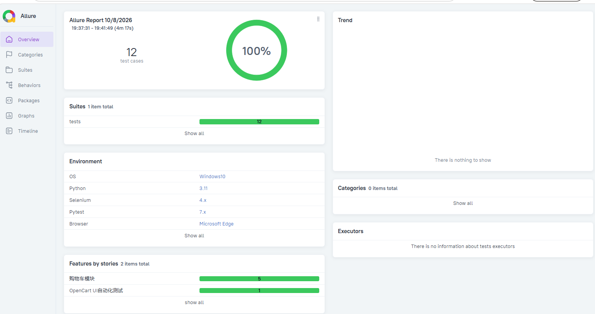
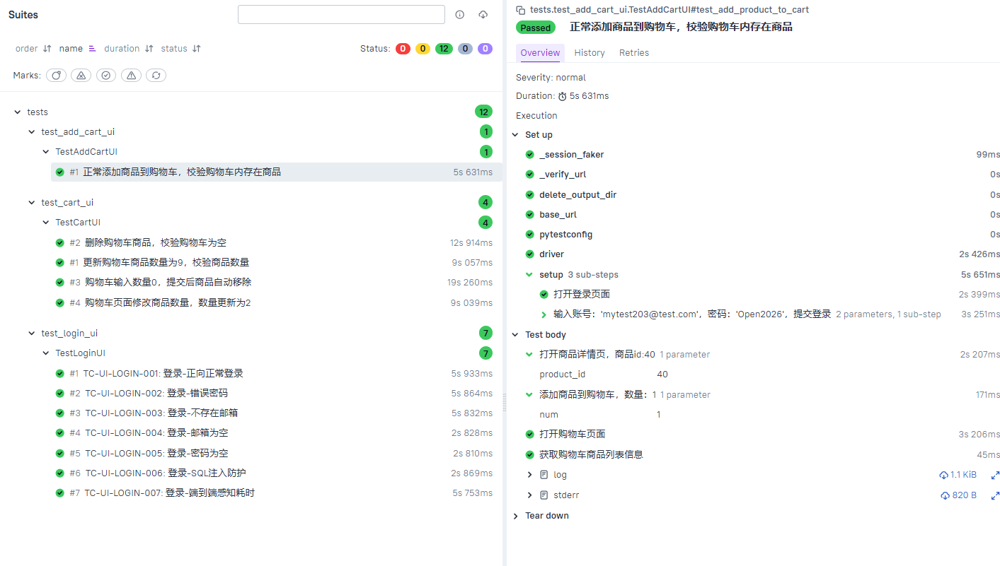
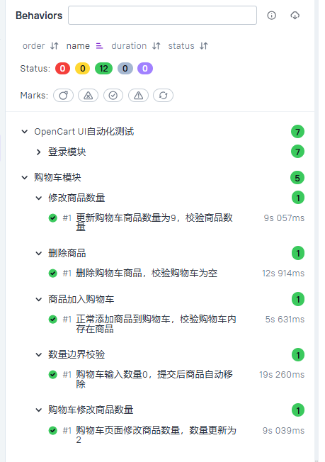

# OpenCart UI 自动化测试
[](https://github.com/StillStream-ink/opencart-auto-test/actions/workflows/test.yml)
---
## 项目简介
基于 **Selenium + Python + POM 分层架构** 实现的 OpenCart 电商系统 UI 自动化测试项目。覆盖登录、注册、购物车、结算四大核心模块，共 **19 条** UI 自动化用例，本地执行**通过率 100%**。

- **分层架构**：BasePage（公共操作）→ Pages（页面封装）→ Flows（业务流程）→ Tests（用例断言）
- **失败自动截图**：用例失败自动截全屏图挂载到 Allure 报告，同时保存到 `screenshots/` 目录，快速定位缺陷
- **双通道通知**：飞书机器人推送结构化测试报告，邮件作为备用通知
- **CI 集成**：GitHub Actions 在 push/PR 时自动触发，Windows 定时任务每日静默运行

---

## 技术栈
| 工具 | 用途 |
|------|------|
| Python 3.11 | 编程语言 |
| Selenium | 浏览器自动化 |
| webdriver-manager | 自动管理浏览器驱动，无需手动下载 |
| Pytest | 测试框架 |
| Allure | 交互式测试报告（自动生成环境信息） |
| POM | 页面对象模型，分层设计 |
| GitHub Actions | 持续集成 CI |
| 飞书 Webhook | 测试结果消息推送 |

---

## 📊 测试报告展示
本项目使用 Allure 生成可视化测试报告，可查看通过率、环境信息、业务模块分组、单条用例执行步骤。

### 报告总览

> 展示全部12条测试用例，通过率100%，附带运行环境信息。

### 测试套件与用例详情

> 展示所有测试套件，可查看每条用例执行状态、耗时；点开用例能够看到分步执行的操作、日志。

### 业务模块分层 Feature/Story

> 通过 allure.feature、allure.story 对用例做业务分层，划分为登录模块、购物车模块，贴合真实项目测试管理思路。
---

## 项目结构
```
opencart-auto-test/
├── .github/workflows/     # GitHub Actions CI 配置
├── pages/                 # PO 页面层
│   ├── base_page.py       # 公共操作（点击重试、滚动、元素等待）
│   ├── login_page.py
│   ├── register_page.py
│   ├── cart_page.py
│   └── checkout_page.py
├── flows/                 # 业务流程封装层
│   └── checkout_flow.py   # 完整下单流程：登录→加购→填地址→提交订单
├── tests/                 # 测试用例层，只保留断言逻辑
│   ├── test_login_ui.py   # 7 条登录模块用例
│   ├── test_register_ui.py# 6 条注册模块用例
│   ├── test_cart_ui.py    # 5 条购物车用例
│   └── test_checkout_ui.py# 1 条完整结算下单用例
├── data/                  # 测试数据管理
│   ├── __init__.py
│   └── test_data.py       # 收货地址、测试账号等数据
├── tools/                 # 工具脚本目录
│   ├── send_feishu.py     # 飞书消息推送脚本
│   └── send_email.py      # 邮件通知备用脚本
├── reports/               # Allure 报告统一存放
│   ├── allure-results
│   └── allure-report
├── screenshots/           # 失败截图存放目录
├── config.py              # 全局配置，环境变量注入
├── conftest.py            # pytest 全局 Fixture：driver 初始化、失败截图钩子
├── daily_test.bat         # Windows 定时任务一键静默执行脚本
├── run_ui_tests.bat       # 本地一键运行脚本
├── requirements.txt       # python 依赖清单
├── .env                   # 环境变量文件（git 忽略）
├── .gitignore
└── README.md
```

---

## 设计亮点

### 1. 分层架构，职责分离

BasePage（公共封装） → Pages（页面元素与操作） → Flows（跨页面业务流程） → Tests（断言用例）

- **BasePage**：封装 `click()` 自带重试、`input_text()`、滚动、元素等待方法，统一处理 Selenium 等待，减少重复代码
- **Pages**：每个页面独立类，管理元素定位器、页面操作方法
- **Flows**：编排跨页面完整业务链路，例如 `full_checkout_process` 串联登录、加购、结算全流程
- **Tests**：只写断言，不写底层页面操作，业务与底层代码解耦

### 2. Fixture 统一管理浏览器驱动

`conftest.py` 提供 driver fixture，自动初始化浏览器，CI 环境自动开启无头模式，用例执行完成自动关闭浏览器：

```python
@pytest.fixture(scope="function")
def driver():
    options = Options()
    # CI环境开启无头
    if os.getenv("CI"):
        options.add_argument("--headless=new")
    options.add_argument("--start-maximized")
    driver = webdriver.Chrome(
        service=Service(ChromeDriverManager().install()),
        options=options
    )
    yield driver
    driver.quit()
```

### 3. 用例失败自动截图

通过 `pytest_runtest_makereport` 钩子捕获用例执行结果，失败时捕获截图并附加到 Allure 报告：

```python
@pytest.fixture(autouse=True)
def capture_screenshot(request, driver):
    yield
    if hasattr(request.node, "rep_call") and request.node.rep_call.failed:
        png_bytes = driver.get_screenshot_as_png()
        allure.attach(png_bytes, name="失败全屏截图", attachment_type=allure.attachment_type.PNG)
```

### 4. Allure 报告环境信息自动生成

测试执行完毕自动生成 `environment.properties`、`executor.json` 等文件，报告自带环境信息，无需手动维护。

### 5. 配置解耦，环境变量注入

`BASE_URL`、测试账号、飞书 Webhook 全部读取环境变量，敏感信息不硬编码，本地 / CI 环境一键切换：

```python
BASE_URL = os.getenv("BASE_URL", "http://127.0.0.1/opencart")
TEST_EMAIL = os.getenv("TEST_EMAIL", "demo@test.com")
TEST_PASSWORD = os.getenv("TEST_PASSWORD", "123456")
# Webhook敏感信息，不提交代码仓库
FEISHU_WEBHOOK = os.getenv("FEISHU_WEBHOOK", "")
```

### 6. 双通道消息通知

- **飞书机器人**：执行完成自动推送 Markdown 报告，包含总用例数、通过率、耗时
- **邮件通知**：作为备用通知渠道，同样读取环境变量，不泄露密钥

---

## 测试覆盖

| 模块 | 用例数 | 通过 | 通过率 |
|------|--------|------|--------|
| 登录 | 7 | 7 | 100% |
| 注册 | 6 | 6 | 100% |
| 购物车 | 5 | 5 | 100% |
| 结算 | 1 | 1 | 100% |
| **合计** | **19** | **19** | **100%** |

### 覆盖场景

- **正向流程**：登录、注册、商品加购、修改购物车数量、删除商品、完整下单结算
- **异常场景**：错误密码、不存在邮箱、空输入字段、邮箱格式非法、密码长度不足、隐私协议未勾选
- **安全测试**：SQL 注入防护、未登录访问结算页面权限校验
- **性能冒烟**：登录端到端耗时校验

---

## 快速开始

### 前置条件

1. 本地部署 OpenCart 4.1.0.3（XAMPP）
2. 启动 Apache + MySQL (MariaDB)
3. 访问地址：http://127.0.0.1/opencart

### 安装依赖

```bash
pip install -r requirements.txt
```

`requirements.txt` 核心依赖：pytest, selenium, webdriver-manager, allure-pytest, python-dotenv

### 配置环境变量

新建 `.env` 文件（已加入 `.gitignore`，不上传代码仓库）：

```
FEISHU_WEBHOOK=https://open.feishu.cn/open-apis/bot/v2/hook/你的webhook地址
```

### 执行测试命令

```bash
# 执行全部用例（本地有头模式，弹出浏览器）
py -m pytest tests/ -v

# 执行全部用例，生成allure结果目录
py -m pytest tests/ -v --alluredir=reports/allure-results --clean-alluredir

# 启动Allure查看报告
allure serve reports/allure-results

# 单独执行登录模块用例
py -m pytest tests/test_login_ui.py -v
```

- Windows 一键脚本：`run_ui_tests.bat`
- 定时静默执行脚本：`daily_test.bat`

---

## 持续集成

| 方式 | 说明 |
|------|------|
| GitHub Actions | 代码 push / PR 提交自动触发，Linux 无头浏览器运行 |
| Windows 定时任务 | 本地服务器每日定时自动执行 |
| 飞书通知 | 测试结束推送结果消息 |

CI 要点：Linux 无图形环境，Selenium 必须开启 `--headless=new` 无头模式；webdriver-manager 自动下载对应浏览器驱动，无需预装。Allure 报告仅本地生成，不提交 CI 产物（已由 `.gitignore` 过滤）。

---

## 测试报告

Allure 交互式报告：包含用例执行状态、耗时、历史趋势、失败截图、环境信息。

---

## 环境变量配置

| 变量名 | 说明 | 默认值 |
|--------|------|--------|
| BASE_URL | OpenCart 服务地址 | http://127.0.0.1/opencart |
| TEST_EMAIL | 测试账号邮箱 | 本地默认值 |
| TEST_PASSWORD | 测试账号密码 | 本地默认值 |
| FEISHU_WEBHOOK | 飞书机器人地址 | 无 |

---

## 飞书通知配置

1. 飞书群添加自定义机器人，获取 Webhook 地址
2. 在 `.env` 配置 FEISHU_WEBHOOK
3. 执行验证消息推送：

```bash
python tools/send_feishu.py
```

---

## 相关链接

- OpenCart 官网：https://www.opencart.com/
- Selenium 官方文档：https://www.selenium.dev/
- 项目 GitHub 地址：https://github.com/StillStream-ink/opencart-auto-test

---

## 测试环境

| 项目 | 配置 |
|------|------|
| 系统版本 | OpenCart 4.1.0.3 |
| 部署方式 | XAMPP 本地部署 |
| 操作系统 | Windows10（本地）/ Ubuntu（GitHub Actions CI） |
| 浏览器 | Chrome |
| 测试地址 | http://127.0.0.1/opencart |
